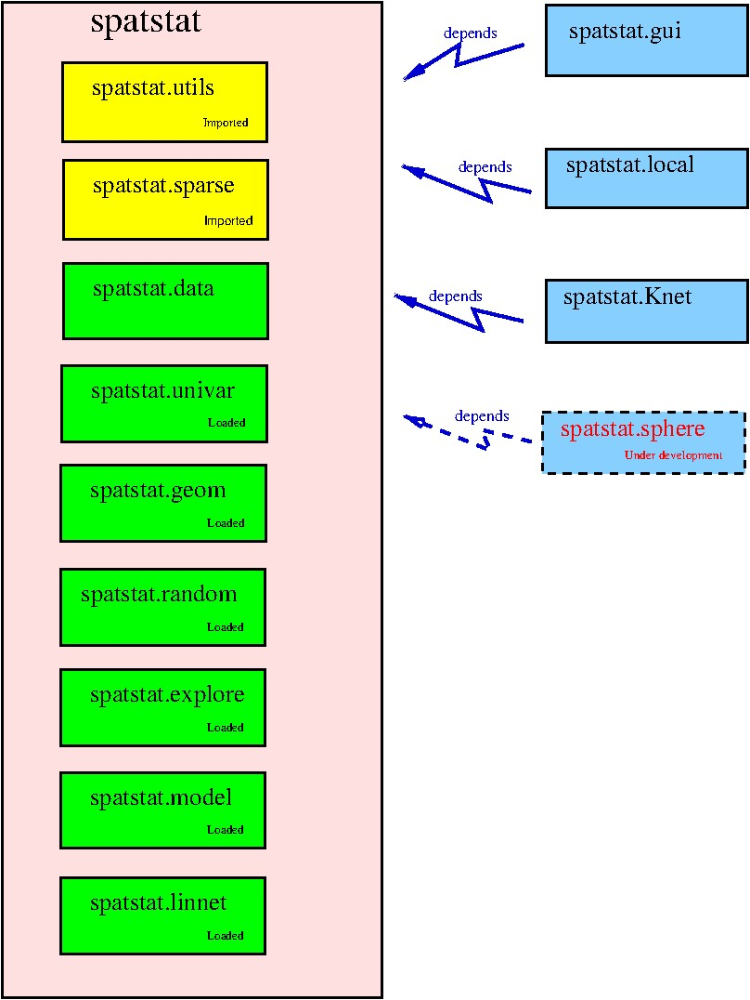

spatstat
========

`spatstat` is a family of R packages for analysing 
spatial point pattern data (and other kinds of spatial data).
It has extensive capabilities for exploratory analysis,
statistical modelling, simulation and statistical inference.

See the website [www.spatstat.org](http://www.spatstat.org)
or read the [book](http://book.spatstat.org).

Contents:

 - [spatstat is a family of packages](#family)
 - [Extension packages](#extensions)
 - [Family portrait](#portrait)
 - [Installing the package](#installing)
 - [Bug reports](#bugreports)
 - [Questions](#questions)
 - [Proposing changes to code](#proposing)
 - [Future development](#future)

___

## <a name="family"></a> spatstat has been split into a family of packages

Originally there was a single package called `spatstat`.
It grew so large that CRAN required us to split it into pieces.

The original `spatstat` has now been divided into a family of 10 sub-packages:

| Sub-package | CRAN page | GitHub repository | Description |
| ----------  | --------- | ----------------- | ----------  |
| `spatstat.utils` | [](http://CRAN.R-project.org/package=spatstat.utils) | [](https://github.com/spatstat/spatstat.utils) | Basic utilities |
| `spatstat.data` | [](http://CRAN.R-project.org/package=spatstat.data) | [](https://github.com/spatstat/spatstat.data) | Datasets |
| `spatstat.sparse` | [](http://CRAN.R-project.org/package=spatstat.sparse) | [](https://github.com/spatstat/spatstat.sparse) | Sparse arrays |
| `spatstat.univar` | [](http://CRAN.R-project.org/package=spatstat.univar) | [](https://github.com/spatstat/spatstat.univar) | Univariate probability distributions |
| `spatstat.geom` | [](http://CRAN.R-project.org/package=spatstat.geom) | [](https://github.com/spatstat/spatstat.geom) | Spatial data classes; geometrical operations |
| `spatstat.random` | [](http://CRAN.R-project.org/package=spatstat.random) | [](https://github.com/spatstat/spatstat.random) |  Generation of random patterns |
| `spatstat.explore` | [](http://CRAN.R-project.org/package=spatstat.explore) | [](https://github.com/spatstat/spatstat.explore) | Exploratory Data Analysis of spatial data |
| `spatstat.model` | [](http://CRAN.R-project.org/package=spatstat.model) | [](https://github.com/spatstat/spatstat.model) |  Parametric modelling and formal inference for spatial data |
| `spatstat.linnet` | [](http://CRAN.R-project.org/package=spatstat.linnet) | [](https://github.com/spatstat/spatstat.linnet) | Spatial analysis on a linear network |
| `spatstat` | [](http://CRAN.R-project.org/package=spatstat) | [](https://github.com/spatstat/spatstat) | Umbrella package: introduction, vignettes, documentation |

Click the green badge to visit the CRAN page which contains the current
release of each sub-package.
Click the blue badge to visit the GitHub repository
for the current development version of the sub-package

There still exists a package called `spatstat`, which is now an
**umbrella package** that requires all the sub-packages listed above,
and provides introductory guides and vignettes.

You can install and load the new `spatstat` family in virtually the
same way as you would previously have installed and loaded the old `spatstat` package.
When you install the new umbrella package `spatstat`, all the sub-packages listed above will
be installed. When you load the new umbrella `spatstat` package in an R session,
all the sub-packages listed above will be loaded or imported.

Each official release has a version number like `1.2-3`, while a development
version has a number like `1.2-3.004`, which R recognises as a 
later version than `1.2-3`.

##  <a name="extensions"></a> Extension packages

Additionally there are **extension packages** which contain more
functionality. These packages are not automatically installed or loaded;
the user must do that if these extra features are desired.

| Extension package | CRAN page | GitHub repository | Description |
| ----------------  | --------- | ----------------- | ----------  |
| `spatstat.gui` | [](http://CRAN.R-project.org/package=spatstat.gui)  | [](https://github.com/spatstat/spatstat.gui) | Graphical interface |
| `spatstat.Knet` | [](http://CRAN.R-project.org/package=spatstat.Knet) | [](https://github.com/spatstat/spatstat.Knet) | linear networks |
| `spatstat.local` | [](http://CRAN.R-project.org/package=spatstat.local) | [](https://github.com/baddstats/spatstat.local) | Local (geographically weighted) models |
| `spatstat.sphere` | Not yet published | [](https://github.com/spatstat/spatstat.sphere) | Spherical data |

##  <a name="portrait"></a> Family portrait 

The pink box marked `spatstat` contains all the code that will be
installed when you install the `spatstat` umbrella package, and loaded
or imported when you load the `spatstat` umbrella package.

The blue boxes are extension packages which must be installed and loaded
separately.



___

## <a name="installing"></a> Installation

### Installing the official release

To install the official release of `spatstat` from CRAN, start `R` and type

```R
install.packages('spatstat', dependencies=TRUE)
```

This will install the 10 packages depicted in the pink box above.

To install the extension packages (blue boxes) you need to do the same
thing for each extension package, e.g.

```R
install.packages('spatstat.local')
```

To check that the installation has been successful,
check that the version numbers of the packages
(which are printed when you load the packages)
match the version numbers of the official releases
listed above (green badges). If this is not true, you may need to un-install
the previous installation of `spatstat`, or check the file permissions
which apply to the filespace where `R` is installed.


### Installing the development version

You can install the development version of `spatstat`
from the GitHub repositories (which you are visiting now)
or from  [r-universe](http://spatstat.r-universe.dev).

The easiest way is to install the development version from `r-universe`:

```R
repo <- c('https://spatstat.r-universe.dev', 'https://cloud.r-project.org')
install.packages("spatstat", dependencies=TRUE, repos=repo)
```

and again to install the development version of
the extension package `spatstat.local`,

```R
install.packages("spatstat.local", repos=repo)
```

Check that the installation was successful by comparing version numbers
as explained above.

___

## <a name="bugreports"></a> Bug reports 

Users are encouraged to report bugs.
If you find a bug in a `spatstat` function,
please identify the sub-package containing that function.
Visit the GitHub repository for the sub-package, 
click the `Issues` tab at the top of the page, 
and press *new issue* to start a new bug report, documentation correction
or feature request.

**Please do not post questions** on the Issues pages,
because they are too clunky for correspondence.

## <a name="questions"></a> Questions about spatstat

For questions about `spatstat`, first check 
the question-and-answer website
[stackoverflow](http://stackoverflow.com/questions/tagged/spatstat)
to see whether your question has already been asked and answered.
If not, you can either post your question at stackoverflow, or
email the authors.

## <a name="proposing"></a> Proposing changes to the code

Feel free to fork `spatstat` or one of its sub-packages,
make changes to the code,
and ask us to include them in the package by making a github *pull request*. 

## <a name="future"></a> Future development

`spatstat` is the result of 30 years of software development
and contains over 200,000 lines of code.
It is still under
development, motivated by the needs of researchers in many fields,
and driven by innovations in statistical science.
We welcome contributions of code, and suggestions
for improvements.
