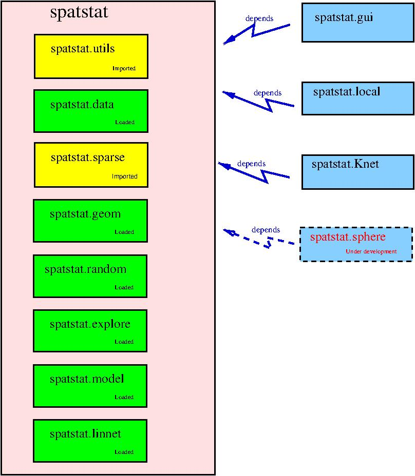

spatstat
========

## What is spatstat?

`spatstat` is a family of R packages for analysing 
spatial point pattern data (and other kinds of spatial data).
It has extensive capabilities for exploratory analysis,
statistical modelling, simulation and statistical inference.

See the website [www.spatstat.org](http://www.spatstat.org)
or read the [book](http://book.spatstat.org).

## spatstat has been split into a family of packages

Originally there was a single package called `spatstat`.
It grew so large that CRAN required us to split it into pieces.

The original `spatstat` has now been divided into a family of sub-packages:

| Sub-package | CRAN page | GitHub repository | Description |
| ----------  | --------- | ----------------- | ----------  |
| `spatstat.utils` |  |  | Basic utilities |
| `spatstat.data` |  |  | Datasets |
| `spatstat.sparse` |  |  | Sparse arrays |
| `spatstat.geom` |  |  | Spatial data classes; geometrical operations |
| `spatstat.random` |  |  |  Generation of random patterns |
| `spatstat.core` |  | :kangaroo:  :kangaroo: | OBSOLETE :kangaroo: :kangaroo: Has been split into `spatstat.explore` and `spatstat.model` |
| `spatstat.explore` |  |  | :kangaroo: :kangaroo: NEW :kangaroo: :kangaroo: Exploratory Data Analysis of spatial data |
| `spatstat.model` |  |  | :kangaroo: :kangaroo: NEW :kangaroo: :kangaroo: Parametric Modelling and Formal Inference for spatial data |
| `spatstat.linnet` |  |  | Spatial analysis on a linear network |
| `spatstat` |  |  | Umbrella package |

Click the green badge to visit the CRAN page which contains the current
release of each sub-package. Click the blue badge to visit the GitHub repository
for the current development version of the sub-package. 

There still exists a package called `spatstat`, which is now an
**umbrella package** that requires all the sub-packages listed above.

You can install and load the new `spatstat` family in virtually the
same way as you would previously have installed and loaded the old `spatstat` package.
When you install the new umbrella package `spatstat`, all the sub-packages listed above will
be installed. When you load the new umbrella `spatstat` package in an R session,
all the sub-packages listed above will be loaded or imported.

## Extension packages

Additionally there are **extension packages** which contain more
functionality. These packages are not automatically installed or loaded;
the user must do that if these extra features are desired.

| Extension package | CRAN page | GitHub repository | Description |
| ----------------  | --------- | ----------------- | ----------  |
| `spatstat.gui` |   |  | Graphical interface |
| `spatstat.Knet` |  |  | linear networks |
| `spatstat.local` |  |  | Local (geographically weighted) models |
| `spatstat.sphere` | Not yet published |  | Spherical data |

## Family portrait 

The pink box marked `spatstat` contains all the code that will be
installed when you install the `spatstat` umbrella package, and loaded
or imported when you load the `spatstat` umbrella package.

The blue boxes are extension packages which must be installed and loaded
separately.

## Future development

`spatstat` is the result of 30 years of software development
and contains over 175,000 lines of code.
It is still under
development, motivated by the needs of researchers in many fields,
and driven by innovations in statistical science.
We welcome contributions of code, and suggestions
for improvements.
