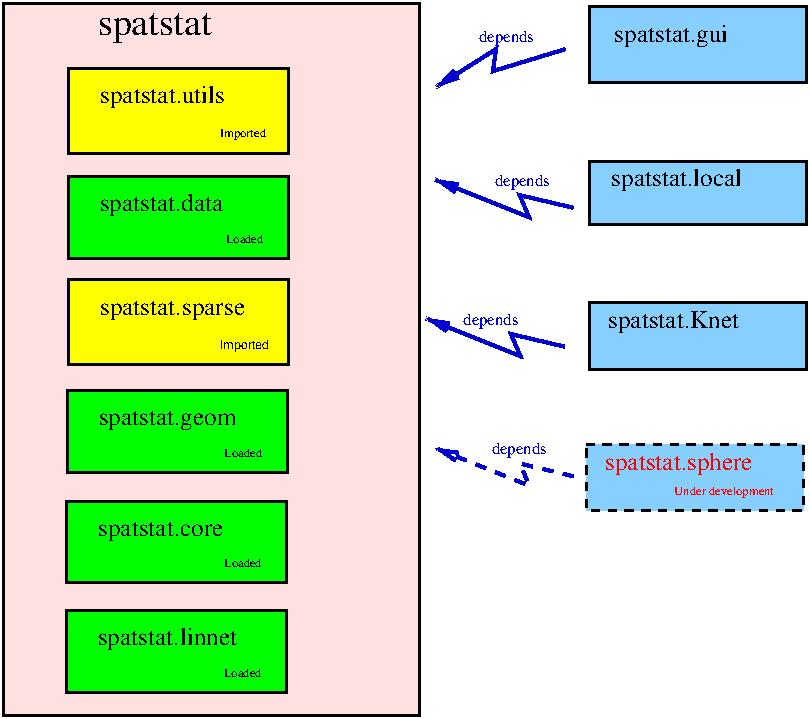

spatstat
========

## What is spatstat?

`spatstat` is a family of R packages for analysing 
spatial point pattern data (and other kinds of spatial data).
See the website [www.spatstat.org](http://www.spatstat.org)
or read the [book](http://book.spatstat.org).

## This is the development version

This repository holds the current **development version** of `spatstat`.

## Where is the official release?

For the most recent **official release** of `spatstat`,
see the [CRAN page](https://cran.r-project.org/web/packages/spatstat).

## spatstat has been split into a family of packages

The `spatstat` package has grown so large that CRAN require us
to split it into sub-packages. This process is almost finished.
Almost all of the code in the original `spatstat` has been removed,
and placed into a series of sub-packages:

| Sub-package | CRAN page | GitHub repository | Description |
| ----------  | --------- | ----------------- | ----------  |
| `spatstat.utils` | [here](https://cran.r-project.org/web/packages/spatstat.utils) | [here](https://github.com/spatstat/spatstat.utils) | Basic utilities |
| `spatstat.data` | [here](https://cran.r-project.org/web/packages/spatstat.data) | [here](https://github.com/spatstat/spatstat.data) | Datasets |
| `spatstat.sparse` | [here](https://cran.r-project.org/web/packages/spatstat.sparse) | [here](https://github.com/spatstat/spatstat.sparse) | Sparse arrays |
| `spatstat.geom` | [here](https://cran.r-project.org/web/packages/spatstat.geom) | [here](https://github.com/spatstat/spatstat.geom) | Spatial data classes; geometrical operations |
| `spatstat.core` | [here](https://cran.r-project.org/web/packages/spatstat.core) | [here](https://github.com/spatstat/spatstat.core) | Data analysis and modelling of spatial data |
| `spatstat.linnet` | [here](https://cran.r-project.org/web/packages/spatstat.linnet) | [here](https://github.com/baddstats/spatstat.linnet) | Spatial analysis on a linear network |
| `spatstat` | [here](https://cran.r-project.org/web/packages/spatstat) | This repo | Umbrella package |

There will still exist a package called `spatstat`, which is now an
**umbrella package** that requires all the sub-packages listed above.
When you install the new `spatstat`, all the sub-packages listed above will
be installed. When you load the `spatstat` package in an R session,
all the sub-packages listed above will be loaded or imported.

Additionally there are **extension packages** which contain additional
functionality. These packages are not automatically installed or loaded;
the user must do that if these extra features are desired.

| Extension package | CRAN page | GitHub repository | Description |
| ----------------  | --------- | ----------------- | ----------  |
| `spatstat.gui` | [here](https://cran.r-project.org/web/packages/spatstat.gui) | [here](https://github.com/spatstat/spatstat.gui) | Graphical interface |
| `spatstat.Knet` | [here](https://cran.r-project.org/web/packages/spatstat.Knet) | [here](https://github.com/spatstat/spatstat.Knet) | linear networks |
| `spatstat.local` | [here](https://cran.r-project.org/web/packages/spatstat.local) | [here](https://github.com/baddstats/spatstat.local) | Local (geographically weighted) models |
| `spatstat.sphere` | Not yet published | [here](https://github.com/spatstat/spatstat.sphere) | Spherical data |

## The new spatstat family

The pink box marked `spatstat` contains all the code that will be
installed when you install the `spatstat` umbrella package, and loaded
or imported when you load the `spatstat` umbrella package.

The blue boxes are extension packages which must be installed and loaded
separately.

