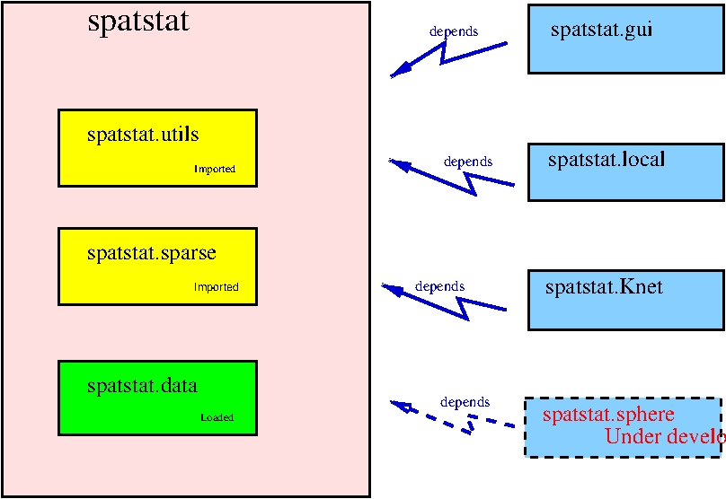

spatstat
========

[](http://cran.r-project.org/web/packages/spatstat)
[](https://travis-ci.org/spatstat/spatstat)
[](https://codecov.io/github/spatstat/spatstat?branch=covr)
[](https://ci.appveyor.com/api/projects/status/github/spatstat/spatstat)

## What is spatstat?

`spatstat` is an R package for analysing 
spatial point pattern data (and other kinds of spatial data).
See the website [www.spatstat.org](http://www.spatstat.org)
or read the [book](http://book.spatstat.org).
  
## This is the development version

This repository holds a copy of the _current development version_ 
of `spatstat`.

This development version is more recent than the *official release* 
of `spatstat` on CRAN. Each official release of `spatstat` has a
version number like `1.2-3` while the development version has a 
version number like `1.2-3.004` (which *R* recognises as a later version).
Official releases occur every 8 weeks
(the minimum time permitted by CRAN policies) while the development code
is updated almost every day. 

## Where is the official release?

For the most recent **official release** of `spatstat`,
see the [CRAN page](https://cran.r-project.org/web/packages/spatstat). 

## spatstat is now split into several packages

Recently we have started the process of splitting `spatstat` into several
packages (as mandated by CRAN, because `spatstat` is very large).



Your existing code will still work:
typing `library(spatstat)` will still give you
access to all the functions in `spatstat` that you know from previous versions.

However, messages from `R` about the installation and loading of the package
will now show that `spatstat` consists of several pieces.
Currently there are four pieces:

  - `spatstat`: contains the main functionality of the `spatstat` family.

  - `spatstat.data`: contains the datasets for the `spatstat` family.
  The current development version of `spatstat.data` is
  [here](https://github.com/spatstat/spatstat.data).

  - `spatstat.utils`: utility functions originally included in `spatstat`
  which are now accessible as a separate package.
  The current development version of `spatstat.utils` is
  [here](https://github.com/spatstat/spatstat.utils).

  - `spatstat.sparse`: functions for linear algebra and sparse arrays,
  originally included in `spatstat`
  which are now accessible as a separate package.
  The current development version of `spatstat.sparse` is
  [here](https://github.com/spatstat/spatstat.sparse).

When you type `library(spatstat)` this will load
the main `spatstat` library
and the `spatstat.data` library, 
and will also *import* the `spatstat.utils` and `spatstat.sparse` libraries.
Importing means that the `spatstat.utils` and `spatstat.sparse` functions
can be used by `spatstat` but cannot be accessed by
the user. To access these utility functions directly, you need to type
`library(spatstat.utils)` and `library(spatstat.sparse)` respectively.

### Extension packages

There are also *extension packages* which provide additional capabilities
and must be loaded explicitly when you need them. 
Currently there are four extension packages:

   . [spatstat.local](https://github.com/baddstats/spatstat.local)
   for local model-fitting, 

   . [spatstat.Knet](https://github.com/spatstat/spatstat.Knet)
   for analysing point patterns on a network of lines,

   . [spatstat.gui](https://github.com/spatstat/spatstat.gui)
   for interactive graphics (containing the functions `iplot` and `istat` that
   were previously part of `spatstat`),

   . [spatstat.sphere](https://github.com/spatstat/spatstat.sphere)
   for analysing point patterns on a sphere
   (_package is still in preparation_).

## Installation

### Installing the official release

To install the official release of `spatstat` from CRAN, start `R` and type

```R
install.packages('spatstat')
```

### Installing the development version

The easiest way to install the development version of `spatstat` 
from github is through the `remotes` package. Start `R` and type

```R
require(remotes)
install_github('spatstat/spatstat.utils', ref='master')
install_github('spatstat/spatstat.data', ref='master')
install_github('spatstat/spatstat', ref='master')
```

If you don't have `remotes` installed you should first run

```R
install.packages('remotes')
```

**For Windows users:** installing via `remotes` requires that RTools is installed
and working. If this is not an option for you, you can also install the
development version by downloading the zip file from
[appveyor](https://ci.appveyor.com/project/baddstats/spatstat/build/artifacts)
(bottom of the page) and installing the package from the downloaded file (which
will be much, much faster than the `remotes` method).

## Bug reports 

Users are encouraged to report bugs here.
Go to 
[issues](https://github.com/spatstat/spatstat/issues) in the menu above, 
and press *new issue* to start a new bug report, documentation correction
or feature request.

**Please do not post questions** on the Issues page,
because it's too clunky for correspondence.

## Questions about spatstat

For questions about `spatstat`, first check 
the question-and-answer website
[stackoverflow](http://stackoverflow.com/questions/tagged/spatstat).
If your question is not listed,
you can either post your question at stackoverflow, or
email the authors.

